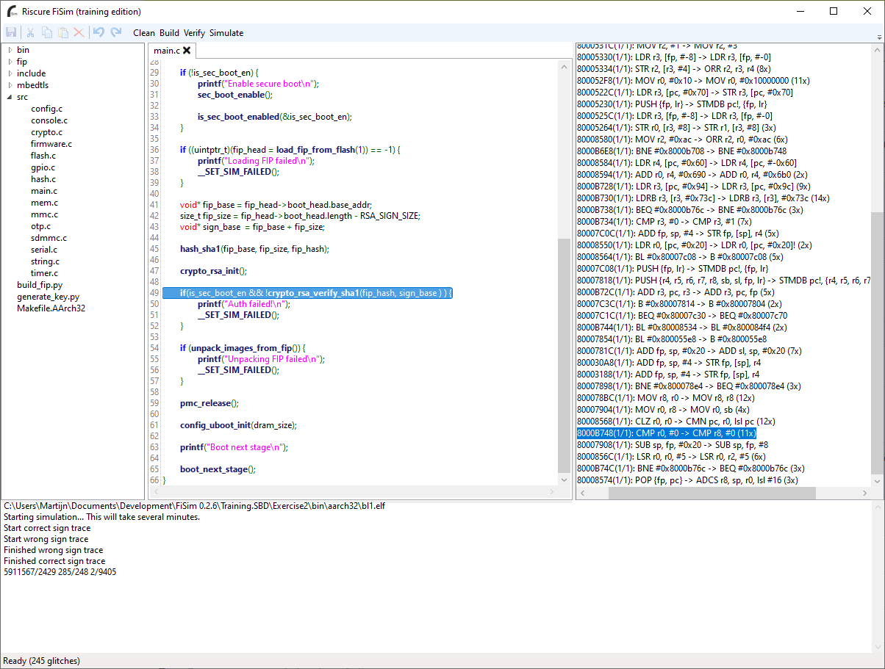

# Riscure FiSim

FiSim is an open-source deterministic fault attack simulator prototype for exploring the effects of fault injection attacks based on the Unicorn Framework and the Capstone disassembler. By simulating faults given one or more fault models, it is possible to explore the effects of these attacks and test the effectiveness of countermeasures. Additionally, it is possible to plan and simulate a specific attack (i.e. the attack payload, etc.) to see whether it will be succesfull or not.

A presentation covering fault attacks and simulating them using FiSim has been given at several conferences including Black Hat EU 2018 [[Slides](https://i.blackhat.com/eu-18/Thu-Dec-6/eu-18-Bogaard-Timmers-Secure-Boot-Under-Attack-Simulation-To-Enhance-Fau....pdf), [Video](https://www.youtube.com/watch?v=7DYkV4uZqS8)], Insomni'Hack 2019 [[Video](https://www.youtube.com/watch?v=_ZLJraOtrDA)] and iSecCon 2019.

FiSim is part of and developed for Riscure's 'Designing Secure Bootloaders' training courses covering the state-of-the-art of modern bootloader attacks and countermeasures. This covers both hardware and software attack techniques and uses the tool to help students learn how to develop effective countermeasures on a realistic bootloader.

For more information regarding our training or tool offering, go to https://www.riscure.com or contact us at inforequest@riscure.com.

## Features

- Simple GUI (Windows-only) that allows compiling and simulating faults in a given code base and then locating faults by jumping (by double clicking on a fault) to the relevant line in the source code.
- Cross-platform simulation of Arm32 and Arm64 code by leveraging the Unicorn Framework.
- Easily creating hardware models using simulated peripherals, code patching and breakpoint callbacks using the PlatformSim library.
- Supports multiple (instruction) fault models: instruction skipping, instruction encoding corruption; including whether or not the fault is cached (i.e. the fault occurs every time an instruction is executed versus it only occurs the Xth time the instruction is executed).

## Fault models

FiSim has a collection of fault models to describe the class(es) of faults it should exhaustively simulate. The fault models are implemented in the FiSim library, which adds fault simulation capabilities to the underlying PlatformSim library. Currently, it only supports fault models that can be modelled by changing the executed instructions or by setting 1 or more breakpoints on specific instructions to change the state of the simulation. 

A fault might occur once when an instruction is executed, a so-called transient fault, or a fault might be persistent for the duration of a simulation, a so-called cached fault. This simulates that the fault was introduced while fetching the instruction and is cached in the icache of the CPU. 

## Limitations

FiSim simply iterates over all possible faults (given 1 or more fault models) and re-executes the target code with every possible fault. Likely, on a real device not all simulated faults are equally realistic or probable, and some faults might not even able to occur at all. Incorporating this information in the simulation is outside the scope of this tool and requires detailed understanding of the target.

This approach makes the simulation (relatively) slow and increasingly complex fault models (e.g. multiple bit flips or data faults) quickly become too slow to simulate in a reasonable amount of time, especially in a training context where quick feedback is prefered over having the maximum level of accuracy or the highest possible amount of identified faults.

## Cross-platform support

While the GUI is Windows-only, the simulation engine is known to also work on Linux and Mac OSX systems using (a recent version of) Mono. Nonetheless, this is not a regurlary tested configuration.

## License

This program is free software; you can redistribute it and/or modify it under the terms of the GNU General Public License as published by the Free Software Foundation; either version 2 of the License, or (at your option) any later version.

This program is distributed in the hope that it will be useful, but WITHOUT ANY WARRANTY; without even the implied warranty of MERCHANTABILITY or FITNESS FOR A PARTICULAR PURPOSE.  See the GNU General Public License for more details.

## Disclaimer

No warranty is provided regarding the accuracy of the simulation results. Simulated faults might not be feasible in a specific chip design nor is the lack of simulated faults proof for fault attack resistance.
Correct interpretation of the results requires expert knowledge of fault attacks and the involved chip design. This is not an official Riscure product and no support is provided.